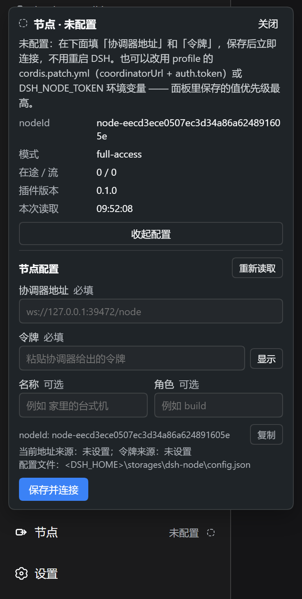

# dsh-node

一个 DSH **Host 侧树外插件**：让本机 DSH 主动连出去（出站 `ws://` / `wss://`），
把 Coordinator 发来的结构化 Remote 调用转发给本机已经注册的 Typert Gateway。

**不监听任何端口、不起任何入站服务、不需要 SSH、不需要公网 IP。**



## 为什么需要它

本机 DSH 里已经注册了一堆能力（会话、文件、skill、模型……），但它们默认只对**这台机器上
的** DSH 窗口可见。想从另一台机器、手机或 CI 里调用它们，常规做法是：开一个端口 → 配内网
穿透或端口映射 → 上 TLS → 加防火墙规则 → 再想办法鉴权。每一步都在**增加**暴露面。

`dsh-node` 把方向反过来：**本机主动连出去一条 WebSocket**，之后只在这条已经建立的连接上
接受调用。于是「能被远程调用」不再等于「有个东西在监听」——进程退出、连接断开，就没有任何
残留的入口。

## 项目结构

```
dsh-node/
├── src/
│   ├── index.ts              # 插件入口：生命周期、能力枚举、路由挂载、宿主可重建
│   ├── connector.ts          # 出站 WebSocket：握手、心跳、重连、发送队列
│   ├── protocol.ts           # dsh-node/1 帧定义与解码（对端输入一律不可信）
│   ├── frame-codec.ts        # endpoint / payload 校验、能力摘要哈希
│   ├── request-manager.ts    # unary 在途请求、取消、超时
│   ├── stream-manager.ts     # stream 泵、背压、恰好一个终态帧
│   ├── config.ts             # 配置校验（唯一权威，启动与面板共用）
│   ├── config-file.ts        # 面板写的 config.json（原子写、0600）
│   ├── config-service.ts     # 面板的读写路径与宿主重建
│   ├── http-api.ts           # /dsh-node/* 本地路由（含唯一的写路由）
│   ├── identity.ts           # nodeId 持久化
│   ├── status.ts             # 脱敏状态快照与结构化日志
│   ├── net/trust-fence.ts    # DNS rebinding / 跨站请求围栏
│   ├── admin/                # nodeAdmin/* 管理面：路径策略、skill、审计
│   └── client/               # 浏览器半侧：侧边栏页脚 + 状态/配置面板
├── test/                     # 13 个文件 / 463 个测试
├── tools/fake-coordinator.mjs  # 本地假协调器，用来观察握手与转发
└── docs/
    ├── COORDINATOR.md        # 与协调器的对接契约
    └── GROUND-TRUTH.md       # 工程记录：实测结论、踩坑、设计取舍
```

## 架构

```
Coordinator                      dsh-node（DSH Host 插件）            本机 DSH
     │                                    │                             │
     │ ① 出站 WS/WSS（唯一一条连接）        │                             │
     │───────────────────────────────────►│                             │
     │ ② hello{token} → hello.ok → ready{capabilities}                  │
     │◄──────────────────────────────────►│                             │
     │ ③ rpc.request{endpoint, payload}   │                             │
     │───────────────────────────────────►│ ④ typertGateway.invoke()     │
     │                                    │────────────────────────────►│
     │ ⑤ rpc.result{ok, value | error}    │                             │
     │◄───────────────────────────────────│                             │
```

- 认证在 ② 完成：`token` 只出现在 `hello.auth` 里，**永远不进 URL**；
- ④ 是普通的 Gateway 调用：参数校验、错误模型、权限判断全由 DSH 自己负责，
  本插件**不新增一层白名单**（`mode: full-access` 的含义就是这个）；
- 节点能提供什么，等于**本机 profile 已经注册了什么**（`ready.capabilities` 会如实列出）。

## 技术栈

**宿主半侧**
- Node.js 20+ / TypeScript（`strict` + `exactOptionalPropertyTypes` + `noUncheckedIndexedAccess`）
- Cordis 插件：服务注入、`ctx.effect()` 生命周期回收
- `ws`（出站 WebSocket）、`schemastery`（配置 schema）—— 运行时依赖只有这两个
- 构建：tsdown（宿主 ESM + 客户端 bundle）

**浏览器半侧**
- React 18，只使用页面平台表提供的 `react` / `react/jsx-runtime`，不打进 bundle
- 注册到侧边栏 `sidebar.footer.action` 槽位（在「画布」上方）
- 无框架依赖的轮询控制器：关闭 15s / 打开 2s / 窗口隐藏时跳过

## 快速开始

### 1. 构建

```bash
pnpm install
pnpm --config.verify-deps-before-run=false typecheck
pnpm --config.verify-deps-before-run=false test
pnpm --config.verify-deps-before-run=false build
```

> `--config.verify-deps-before-run=false` 不是可选的：`pnpm run` 的依赖状态检查会再起一个
> `pnpm install`，在非交互环境里会直接中止。也可以直接调工具：
>
> ```bash
> node node_modules/typescript/bin/tsc -p tsconfig.json --noEmit
> node node_modules/vitest/vitest.mjs run
> ```
>
> `typecheck` 绿**不代表** `build` 绿：`build` 额外跑 `tsc -p tsconfig.build.json`，
> 它只编译 `src/**`（不含 `test/`），是真实的发布类型边界。两个都要跑。

### 2. 装进 profile

```bash
dsh plugin --profile desktop add dsh-node@link:<本仓库绝对路径>
```

再在 profile 的 `cordis.patch.yml` 里插入一行（**必须是 `- insert:` 数组形式**）：

```yaml
- insert:
    - id: dsh-node
      name: 'dsh-node'
```

> 改完 `cordis.patch.yml` **必须重启 DSH**：实测 `patchReload: "live"` 在运行树里不生效
> （hmr 插件没有 active），改 entry / 改 config 后运行中的实例不会跟随。

### 3. 配置

**方式一：面板（推荐）** —— 点侧边栏左下角的「节点」→ 填「协调器地址」和「令牌」→
**保存并连接**。保存后宿主立即按新配置重建并重连，**不需要重启 DSH**。
配置落在 `<DSH_HOME>/storages/dsh-node/config.json`（原子写、`0600`）。
令牌是**只写不读**的：面板里永远只显示「已保存」，值不会回传。

**方式二：profile 配置**

```yaml
- insert:
    - id: dsh-node
      name: 'dsh-node'
      config:
        coordinatorUrl: wss://coordinator.example.com/node
        nodeName: my-desktop
        role: build-agent
        # 其余可调项见 src/config.ts 的 Config / BOUNDS
```

**方式三：环境变量**

| 变量 | 用途 |
| --- | --- |
| `DSH_NODE_TOKEN` | 令牌（**不要**写进 yaml） |
| `DSH_NODE_COORDINATOR_URL` | 协调器地址，便于 headless 部署 |
| `DSH_NODE_IDENTITY_FILE` | 覆盖身份文件路径（必须绝对路径） |
| `DSH_NODE_LOG_LEVEL` | `debug` / `info` / `warn` / `error`，默认 `info` |

**优先级：面板保存的值 > profile 配置 > 环境变量。** 面板里显示的「来源」就是这一层的答案。

**连上之后还要让协调器认识它**：`nodeId` 由节点自己生成，操作者无法提前登记，所以要么把面板里的
`nodeId` 复制到协调器逐台登记（`--node-env <nodeId>:<变量名>`，令牌就不会出现在进程列表里），
要么在协调器里开一个登记密钥、让它自助登记 —— 两种方式见
[`dsh-coordinator`](https://github.com/jaikensai888/dsh-coordinator) 的「登记、轮换、撤销」一节。

### 4. 验证

```bash
# 组合树里有它，且只出现一次
dsh --profile desktop --dump-config    # 在输出里找 dsh-node

# 本地只读路由（不需要重启，直接开在 DSH 的 web 服务上）
curl http://127.0.0.1:<port>/dsh-node/api/status
curl http://127.0.0.1:<port>/dsh-node/api/config
```

界面上的状态点：**实心绿 = 已连接**，环状琥珀 = 连接中/退避重连，空心灰 = 未配置。
悬停有完整句子，形状本身也区分状态（不依赖颜色）。

### 5. 还没有协调器？先和假协调器握手

`tools/fake-coordinator.mjs` 是一个只绑 `127.0.0.1` 的替身：把 `hello` 答成 `hello.ok`、
把每一帧记进日志，并且**写盘前先把令牌替换掉**（只留下「有/无」和长度）。

```bash
node tools/fake-coordinator.mjs          # 握手：会打印 READY endpoints=<能力数> hash=<摘要>
node tools/fake-coordinator.mjs --help   # 还能探针转发、开流、按帧取消
```

把面板里的地址临时填成 `ws://127.0.0.1:39471/node`（令牌随便填一个非空值）就能看到全过程。

不想装进 profile 也可以只跑集成测试 —— 它是**真 Cordis + 真 Typert Gateway + 假协调器**，
覆盖完整握手、unary 转发、能力门禁、断线不重放：

```bash
node node_modules/vitest/vitest.mjs run test/integration.test.ts
```

### 卸载

```bash
dsh plugin --profile desktop remove dsh-node
```

再删掉 `cordis.patch.yml` 里那一行，以及 `<DSH_HOME>/storages/dsh-node/`（身份与配置）。

## 状态与接口

状态机：`unconfigured` → `connecting` → `authenticating` → `ready`；
失败走 `backoff`（指数退避 + 抖动）或 `auth_failed`（凭证被拒，慢速有限重试）；
退出走 `closing`。**未配置不是错误**：不建连接、不进重连循环。

本地路由（前缀 `/dsh-node`，全部经过信任围栏）：

| 方法 | 路径 | 用途 |
| --- | --- | --- |
| GET | `/api/status` | 脱敏状态快照，界面状态点的数据源 |
| GET | `/api/config` | 当前配置（**不含令牌**，只有 `tokenSet`） |
| POST | `/api/config` | 保存配置并立即重连 —— **全插件唯一的写路由** |
| GET | `/api/diagnostics` | 宿主对客户端模块合成的判断（排查「界面里没有它」） |
| GET | `/ping` | 存活探测 |

`nodeAdmin/*` 是本插件唯一能改动本机的部分（13 个端点）：

| 端点 | 作用 |
| --- | --- |
| `describe` / `status` / `capabilities` / `audit` | 诊断与审计 |
| `fsList` / `fsStat` / `fsRead` / `fsWrite` / `fsRemove` | 文件操作，**受允许根约束** |
| `skillsList` / `skillRead` / `skillInstall` / `skillRemove` | skill 管理，只接受名字不接受路径 |

默认允许的根是**活跃 session 的工作目录**（没有 session 就一律拒绝，不会退回整个磁盘）。

### 连不上时看哪里

| 症状 | 先看 | 常见原因 |
| --- | --- | --- |
| 侧边栏里根本没有「节点」 | `/api/diagnostics` 的 `selfComposed` | `false` = 宿主的客户端模块合成器**静默跳过**了这个包（有 `exports` 却没导出 `./package.json`）。改完必须重启 DSH |
| 状态点一直是环状琥珀 | `/api/status` 的 `lastError` | 地址写错、对端没起。退避从 1s 起、每次 ×2、上限 30s、±20% 抖动；连上并稳定 30s 后退避复位 |
| 落到 `auth_failed` | 面板的令牌 + 协调器的登记 | 令牌与 `nodeId` 绑定：换了机器、换了身份文件、或在协调器里撤销过，都要重新登记 |
| 保存被拒（400） | 面板里的 ⚠ 文案 | `node/config-invalid`：地址不是 `ws://` / `wss://`；`node/config-incomplete`：地址或令牌为空 |
| 403 | 请求来源 | 信任围栏：只接受本机回环或已声明的 Host，且拒绝 `sec-fetch-site: cross-site` 与外来 `Origin` |

`POST /api/config` 被拒绝时**不会写入任何东西** —— 配置要么整体生效，要么完全不动。

## 协议（`dsh-node/1`）

| 方向 | 帧 |
| --- | --- |
| Coordinator → Node | `hello.ok` `rpc.request` `rpc.cancel` `stream.open` `stream.cancel` `ping` `pong` `close` |
| Node → Coordinator | `hello` `ready` `rpc.result` `stream.ready` `stream.data` `stream.end` `stream.error` `ping` `pong` `close` |

一次 unary 调用长这样：

```json
{
  "type": "rpc.request",
  "protocolVersion": "dsh-node/1",
  "nodeId": "node-…",
  "requestId": "req-uuid",
  "endpoint": "session/create",
  "payload": { "args": { "workspaceId": "workspace-1" } }
}
```

- `endpoint` 必须**恰好两段** `<namespace>/<method>`；
- `payload` 必须**恰好**是 `{ args: <plain object> }`，且 `args` **原样透传** ——
  Gateway 会做 `assertExactArguments`，多一个字段少一个字段都会报错；
- 错误码只折叠「这个 endpoint 本机没有」这一族为 `node/capability-unavailable`；
  其余（业务错误码与 `gateway/*`）**原码保留**，因为折叠会毁掉协调器需要的诊断信息；
- stream 的背压策略是**先暂停异步迭代器**，排空超时才以 `node/backpressure` 终止该流。

完整帧定义、握手时序与联调边界见 [`docs/COORDINATOR.md`](docs/COORDINATOR.md)。

## 安全边界

| 红线 | 落实方式 |
| --- | --- |
| token 绝不进 URL | URL 里出现凭据参数名直接判配置错误；token 只从配置或环境变量读 |
| token 不进日志 / 错误 / 状态 | 日志统一擦除；状态快照二次擦洗；对端送来的 `close.reason` 按不可信输入处理 |
| 日志里 URL 只留协议+主机+端口 | `redactUrl()`，有测试 |
| 不新增 shell / eval / 任意模块加载 | 源码里没有 `child_process` / `eval` / `new Function` / `require(` / 动态 `import()` |
| 不监听任何入站端口 | 源码里没有 `WebSocketServer` / `createServer` / `.listen(`，有架构守卫逐文件扫描 |
| 只有一条前缀路由，只有一个写路由 | `webServer.register` 只允许出现在 `index.ts` 一处；写路由只有 `POST /api/config` |
| 不自动重放未确认的写操作 | 断线时在途请求以 `node/connection-lost` 失败，绝不重发 |

界面**故意**不提供放宽 `allowedRoots`（文件系统围栏）的入口：把围栏打开不该是一次点击的事。

## 开发进度

### Phase 1：出站连接与 unary 转发 ✅
- [x] 出站 WebSocket、握手鉴权、心跳、指数退避重连
- [x] `rpc.request` / `rpc.cancel` / `rpc.result`，超时与取消按 id 触发 `AbortSignal`
- [x] 能力枚举与 `remoteSurfaceHash`
- [x] 身份持久化（`nodeId` 跨重启不变）

### Phase 2：stream 与背压 ✅
- [x] `stream.open` / `ready` / `data` / `end` / `error`，`seq` 单调
- [x] 先暂停迭代器的背压，排空超时才终止
- [x] 并发上限、单帧上限、待发缓冲上限，各自有稳定错误码

### Phase 3：管理面 `nodeAdmin/*` ✅
- [x] 受路径策略约束的文件读写（realpath + 段感知包含判定）
- [x] skill 安装 / 读取 / 卸载（只接受名字）
- [x] 操作审计环形缓冲

### Phase 4：协调器 ✅（在另一个仓库）
- [x] [`dsh-coordinator`](https://github.com/jaikensai888/dsh-coordinator)：接受节点连接、转发调用、运维 API
- [x] 跨实现联调：真的节点 × 真的协调器

### 状态入口与配置面板 ✅
- [x] 侧边栏页脚一行「节点」：形状+颜色双重编码的状态点，浮层显示脱敏状态
- [x] 面板内配置协调器地址与令牌，保存即重连（不用重启 DSH）
- [x] 未配置的节点也会加载身份，使 `nodeId` 在首次连接前就可用
- [x] 463 个测试 / 13 个文件，含架构守卫（不开监听、只允许一条路由、宿主半侧不碰 DOM）

## 下一步与已知限制

- **心跳语义：协议比实现松**。线协议只要求协调器能发心跳帧，没有规定它必须回 `pong`；而节点在
  超过 2 个心跳周期收不到 `pong` 时会判为半开连接并重连。`dsh-coordinator` 会回，别的实现得照做。
- **`rpc.cancel` 与请求超时还没有真实环境的证据**：两者都需要无副作用的慢方法，目前由
  `request-manager` 单测与 `integration.test.ts` 的组合测试覆盖（`stream.cancel` 已在真机联调中验证）。
- **`gateway/*` 原码保留要求 DSH ≥ `0.1.2-alpha.2`**：更早的 `alpha.1` 上网关自己就把边界错误压成
  `internal`，本插件用 `wireStream.failure()` 忠实复现、不自己抠码。当前 `0.1.5-rc.2` 成立。
- **源码模式插件的 namespace 枚举**依赖上游公开的 `typertRemote` 绑定：上游若改成私有，这类插件
  会无法被派发（生成器插件不受影响）。

## License

MIT —— 见 [`LICENSE`](LICENSE)。
